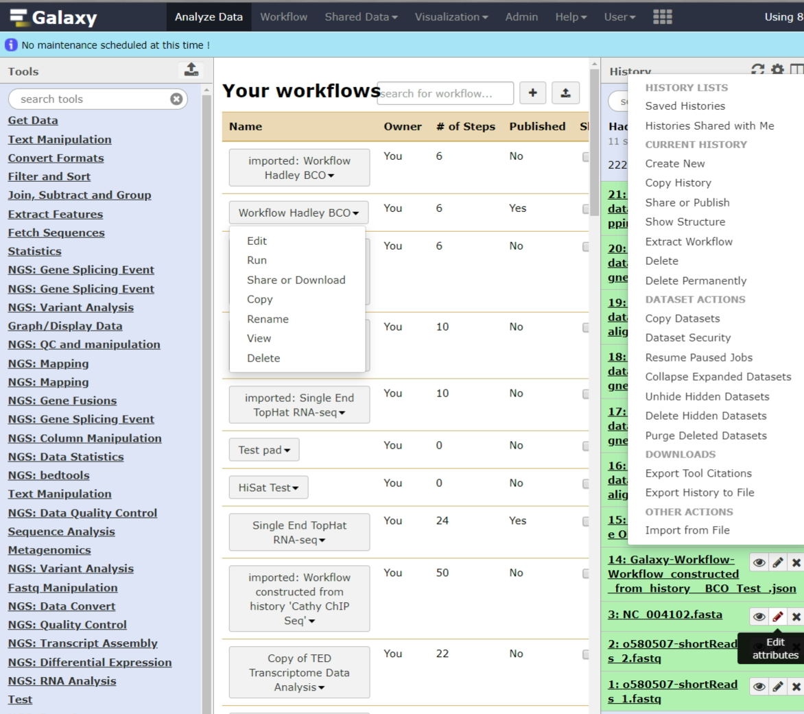
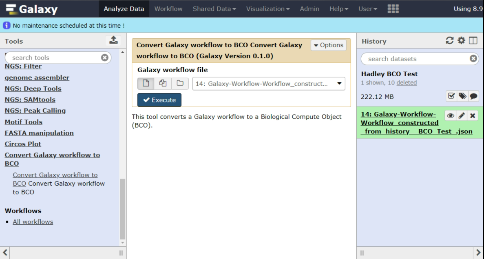
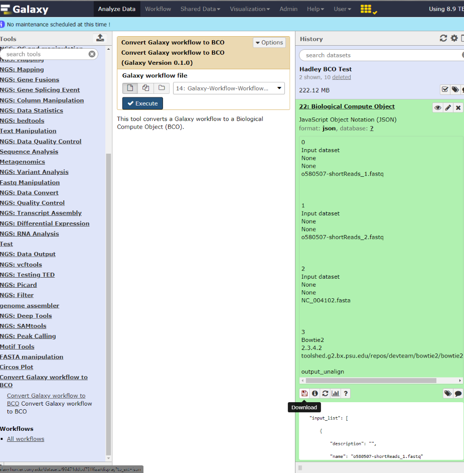

# Galaxy-To-BCO

# Introduction

This provides a Galaxy tool enabling conversion of bioinformatics workflows and histories from Galaxy to Biological Compute Objects (BCO). The implementation follows the standardized development approach for Galaxy (https://galaxyproject.org/admin/tools/add-tool-tutorial/) and will become also available on the **Galaxy Toolshed**.

There are two steps in the process of exporting BCO :

- First, download an existing workflow that you have in Galaxy as a **.json** file, or you can also first convert a history as workflow and then export it:     

> For details on using Galaxy for bioinformatics analysis, workflows and histories see https://galaxyproject.org/learn/.

 
- Second, locate the "Convert Galaxy workflow to BCO" tool from the list on the left pane of Galaxy. When selected, the middle pane of Galaxy will show the converter interface and it will also automatically recognise the **.json file** as input. The "Execute" button will initiate the conversion:      

- Finally, following completion of the conversion, the BCO object will appear in the Galaxy history where it can be exported and shared, using the "Download" button in the Galaxy history as shown in the image below:    
